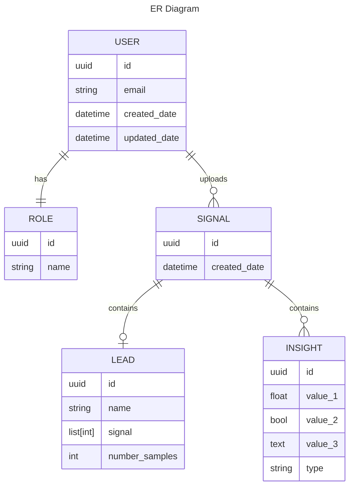

# cuddly-giggle

Small exercise using FastAPI and other tools

## The idea

The task is to generate a group of APIs that will handle signal information and enrich the signals with insights, this information will be guarded roles related to what a `user` can do with the access.
The expectation is to generate:

* An endpoint to receive a Signal with a given structure
* An endpoint to return a Signal with insights if uploaded by the same user
* _Optional_ An endpoint to get the ids of all the signals uploaded by a user (for the same user only)
* _Optional_ An endpoint to generate new user (Admin user only)

### What's an _Insight_

It is relevant data found into the signal after applying some kind of processing.
Available insights:

* Number of times the signal crosses Zero

## The DB
For this exercise we will use _SQLAlchemy_ with Postrgres.

_created using [mermaid](https://mermaid.js.org/)_

## How to setup

### Requirements

* docker
* docker compose

### Startup

#### docker compose

### Swagger

#### Testing credentials

## How to test

### pytest

### test coverage
