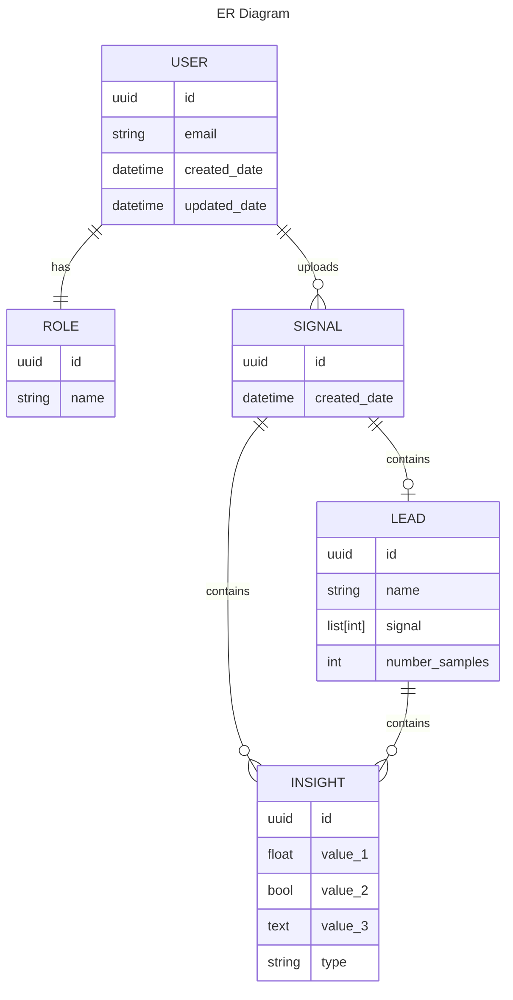

# cuddly-giggle

Small exercise using FastAPI by Daniel Vélez Marín.

## [The idea](https://github.com/idoven/backend-challenge)

The task is to generate a group of APIs that will handle signal information and enrich the signals with insights, this information will be guarded roles related to what a `user` can do with the access.
The expectation is to generate:

* An endpoint to receive a Signal with a given structure, for this project I decided to call it a _biosignal_ for more generality.
* An endpoint to return a Signal with insights if uploaded by the same user.
* _Optional_ An endpoint to get the ids of all the signals uploaded by a user (for the same user only).
* _Optional_ An endpoint to generate new user (Admin user only).

### What's an _Insight_

It is relevant data found into the signal after applying some kind of processing.
Available insights:

* Number of times the signal crosses Zero.

## The Stack
The idea is to create a simple working backend that uses container orchestation, since we don't want to reinvent the wheel we are leveraging the existing template [FastAPI-PgStarterKit](https://github.com/bibektimilsina000/FastAPI-PgStarterKit) that was created by extracting and fixing the template proposed by the creator of FastAPI ([full-stack-fastapi-postgresql](https://github.com/tiangolo/full-stack-fastapi-postgresql)).

This allows the use of contenerized images with the required packages and lifts the burden of installation/configuration of the db. It also includes authentication using oAuth2 JWT tokens, password hashing, CORS, and some setup for celery workers that is not used this time.

## The DB
For this exercise we will use _SQLAlchemy_ with Postrgres.


_created using [mermaid](https://mermaid.js.org/)_

Note: The Insights may belong to a full biosignal (ECG) or to a single lead

## How to setup

### Requirements

* docker
* docker compose
* python 3.11

### Startup

1. Make sure to populate the file `.env` into the same folder as the `docker-compose.yml` file.

    * If you wish to do some local work, create a virtual environment and run `pip install -r requirements.txt`.

2. Start the docker stack with `docker compose up -d`

3. Go to http://localhost:4000/docs to see the autogenerated docs

    * If you wish to play around in the swagger UI, the credential `FIRST_SUPERUSER` and `FIRST_SUPERUSER_PASSWORD` are available in the `.env` file

    * the biosignal endpoints require a user with the role `client`, this can only be created with a user with the `admin` role (`FIRST_SUPERUSER`)

#### docker compose

This includes 3 services:

* `fastapi-app`: The actual backend that includes all the python code.
* `db`: Includes the postgresql db.
* `pagadmin`: Included in the template used but not used in this exercise, can be removed.

#### Testing

The tests are compatible with `pytest` and can be run individually with `docker compose exec fastapi-app pytest path/to/test.py::test_name`

The file `test.sh` includes a test coverage report (in the terminal), to run it simply use `docker compose exec fastapi-app bash ./test.sh`.

At the moment of writing this, the report looked like:

```bash
---------- coverage: platform linux, python 3.11.6-final-0 -----------
Name                                     Stmts   Miss  Cover   Missing
----------------------------------------------------------------------
app/__init__.py                              0      0   100%
app/api/__init__.py                          0      0   100%
app/api/api_v1/__init__.py                   0      0   100%
app/api/api_v1/api.py                        9      0   100%
app/api/api_v1/endpoints/__init__.py         0      0   100%
app/api/api_v1/endpoints/biosignals.py      62      9    85%   26, 52, 73, 76, 78, 96, 101, 119, 124
app/api/api_v1/endpoints/items.py           42     20    52%   22-28, 56-62, 77, 79, 93-99
app/api/api_v1/endpoints/login.py           47     21    55%   33, 35, 58-69, 81-96
app/api/api_v1/endpoints/roles.py           39      2    95%   59, 93
app/api/api_v1/endpoints/users.py           63     26    59%   48, 66-75, 100-113, 127, 129, 146-153
app/api/api_v1/endpoints/utils.py           16      4    75%   22-23, 34-35
app/api/deps.py                             38      7    82%   35-36, 42, 50, 67-69
app/backend_pre_start.py                    22     22     0%   1-38
app/core/__init__.py                         0      0   100%
app/core/celery_app.py                       3      0   100%
app/core/config.py                          72      6    92%   33, 36, 46, 58, 67, 82
app/core/security.py                        21      1    95%   24
app/crud/__init__.py                         6      0   100%
app/crud/base.py                            39      6    85%   35-40
app/crud/crud_biosignal.py                  32      2    94%   31, 36
app/crud/crud_insight.py                    33      4    88%   37-40
app/crud/crud_item.py                       17      1    94%   25
app/crud/crud_lead.py                       30      4    87%   33-36
app/crud/crud_role.py                       22      1    95%   30
app/crud/crud_user.py                       38      2    95%   36, 51
app/db/__init__.py                           0      0   100%
app/db/base.py                               7      7     0%   3-9
app/db/base_class.py                         9      0   100%
app/db/init_db.py                           15     15     0%   1-37
app/db/session.py                            5      0   100%
app/initial_data.py                         14     14     0%   1-23
app/insights/__init__.py                     1      0   100%
app/insights/zero_crossing.py               18      0   100%
app/main.py                                  8      0   100%
app/models/__init__.py                       6      0   100%
app/models/biosignal.py                     18      3    83%   10-12
app/models/insight.py                       20      1    95%   10
app/models/item.py                          12      1    92%   9
app/models/lead.py                          16      1    94%   10
app/models/role.py                          13      1    92%   10
app/models/user.py                          21      3    86%   10-12
app/schemas/__init__.py                      8      0   100%
app/schemas/biosignal.py                    21      0   100%
app/schemas/insight.py                      35      0   100%
app/schemas/item.py                         18      0   100%
app/schemas/lead.py                         22      0   100%
app/schemas/msg.py                           3      0   100%
app/schemas/role.py                         16      0   100%
app/schemas/token.py                         7      0   100%
app/schemas/user.py                         22      0   100%
app/tests/__init__.py                        0      0   100%
app/tests/api/__init__.py                    0      0   100%
app/tests/api/api_v1/__init__.py             0      0   100%
app/tests/api/api_v1/test_biosignal.py     122      1    99%   175
app/tests/api/api_v1/test_celery.py          0      0   100%
app/tests/api/api_v1/test_items.py          22      0   100%
app/tests/api/api_v1/test_login.py          15      0   100%
app/tests/api/api_v1/test_roles.py          80      0   100%
app/tests/api/api_v1/test_users.py          78      0   100%
app/tests/conftest.py                       25      0   100%
app/tests/crud/__init__.py                   0      0   100%
app/tests/crud/test_biosignal.py            43      0   100%
app/tests/crud/test_insight.py              76      0   100%
app/tests/crud/test_item.py                 52      0   100%
app/tests/crud/test_lead.py                 68      0   100%
app/tests/crud/test_role.py                 58      0   100%
app/tests/crud/test_user.py                 84      0   100%
app/tests/settings/test_settings.py         35      0   100%
app/tests/utils/__init__.py                  0      0   100%
app/tests/utils/biosignal.py                29      4    86%   32-35
app/tests/utils/item.py                     14      0   100%
app/tests/utils/lead.py                     16      3    81%   21-25
app/tests/utils/roles.py                    17      5    71%   18-22
app/tests/utils/user.py                     43      6    86%   48-52, 71-75
app/tests/utils/utils.py                    18      0   100%
app/utils.py                                54     40    26%   19-33, 37-41, 50-56, 71-76, 91-100, 104-108
----------------------------------------------------------------------
TOTAL                                     1935    243    87%
```

There's a small issue with the tests and the DB at the moment, the tests will sometimes populate the DB and erase the data in it, after running the tests you could find test data in the SWAGGER responses due to this. I decided to not fix this issue for the sake of time and since the tests usually will not run in any client facing infra.
